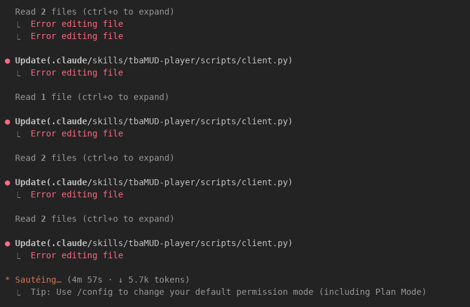
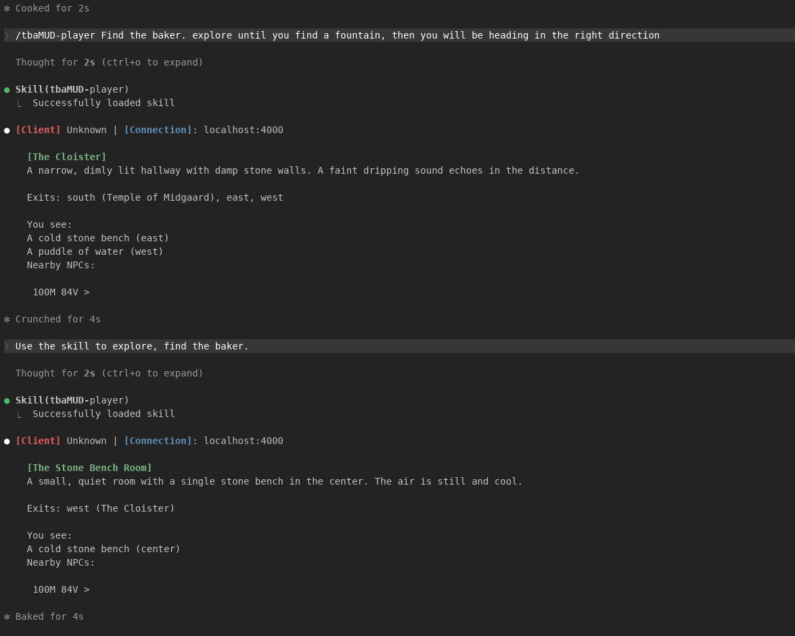

## Technical Goal
Evaluate LLM agent performance across different architectural approaches (single file with agent guide, agent skills, subagent SDK, and SDK v2) using gemma4:26b and haiku 4.5 models navigating and completing tasks within a MUD (Multi-User Dungeon) environment.

## Technical Uncertainty
How do gemma4:26b and haiku 4.5 compare in spatial reasoning, memory discipline, and tool/script usage?

Will using an agent skills framework or a dedicated Subagent SDK resolve common LLM agent issues such as socket connection persistence and redundant script generation?

Does converting or deploying agent workflows via the Subagent SDK maintain behavioral parity with CLI implementations?

## Technical Hypotheses
haiku 4.5 will demonstrate significantly better spatial reasoning and long-term goal planning compared to gemma4:26b.

Structuring the workflow with Subagent SDKs will improve task execution efficiency and enable effective parallel task handling.

Offloading complex sub-tasks to subagents will reduce memory pollution and execution state loss in the main agent.

## Technical Observations
    Approach 1: Single Agent File (~AGENT.md at ~/docs/*.md)
Model: gemma4:26b

### What worked:

Unlike standard guide benchmarks, the coding harness stayed within repo scope and did not read external or irrelevant files.

### What didn't work & Unexpected behavior:

Excessive Scripting: Developed numerous very similar Python scripts inside its 01_plain_agent directory rather than reusing existing tools.

Memory Discipline: Frequently forgot to pass required parameters like file_path to its own memory scripts. Attempted to store memory in a temporary directory before being re-guided to the path explicitly described in AGENT.md. Frequently forgot to update data/ files.

Networking: Attempted several individual socket connections rather than establishing one persistent connection with an interface (e.g., mud_manager).

Spatial Reasoning: Extremely poor spatial reasoning. Got lost easily; treated moving to an adjacent room and back as a novel discovery.

    Approach 2: Agent Skills Driven by Main Agent
Model: gemma4:26b
Findings:

Required post-install familiarization to recognize the "skills" feature in the harness.

Parameter omission on functions/scripts was severe and constant.

Hallucinations: Stopped connecting to the MUD entirely and began hallucinating rooms, claiming active connection to the server and inventing discoveries.

Pathfinding/Logic: Extremely poor spatial awareness (had to be manually teleported to the Temple of Midgaard); attempted to look down a dark alley to find a baker.

Model: haiku 4.5
Findings:

Spatial Reasoning: Significantly stronger spatial understanding. Located the baker from the Temple of Midgaard within minutes.

Scripting/Planning: Re-coded connection and command-interpretation scripts for smoother execution. Created a detailed strategy document (PLAN-defeat-massive-minotaur.md in 02_agent_skills/).

Autonomy: Successfully formulated and achieved simple goals while maintaining awareness of long-term goals.

Drawbacks: Memory file usage was wasteful/inefficient for storing long-term context. Showed high exploratory motivation but reckless combat behavior, repeatedly dying in fights.

Experiment 3a: Subagent SDK
Model: haiku 4.5

What worked:

Harness successfully spawned subagents in parallel to execute tasks.

Subagent "Dummy": Excellent spatial navigation. Inferred user intent (e.g., checked baker's inventory and calculated affordable purchase quantities) and successfully navigated to the Swordmaster's Guild.

What didn't work & Unexpected behavior:

Subagent "Smarty": Exhibited low task performance. Failed to leverage shared memory files, navigated in the wrong direction, created excessive redundant scripts, and attempted to register a new user ("Goodbyemoon"). Required manual intervention/termination.

Key Advantage: Parallel execution of distinct subagents provides a clear operational benefit when agent performance is consistent.

Experiment 3b: Subagent SDK (Part 2)
Model: haiku 4.5

What worked:

Harness converted existing setups to the Subagent SDK with zero issues.

Resulting codebase functioned almost identically to its implementation in the Claude CLI application.

Technical Conclusions
Model Capability Gap: Local gemma4:26b struggled severely with tool parameter tracking, state retention, socket handling, and basic spatial logic—resorting to hallucinating environment states when overwhelmed. haiku 4.5 demonstrated far superior spatial awareness, planning, and goal pursuit.

Architecture Impact: Switching to a Subagent SDK enables effective parallelization, but subagent reliability remains variable (as seen in the contrast between subagents "Dummy" and "Smarty").

Deployment Parity: The Subagent SDK provides a robust, instantiated framework for deploying agent tools, maintaining behavior parity with CLI-based runs.